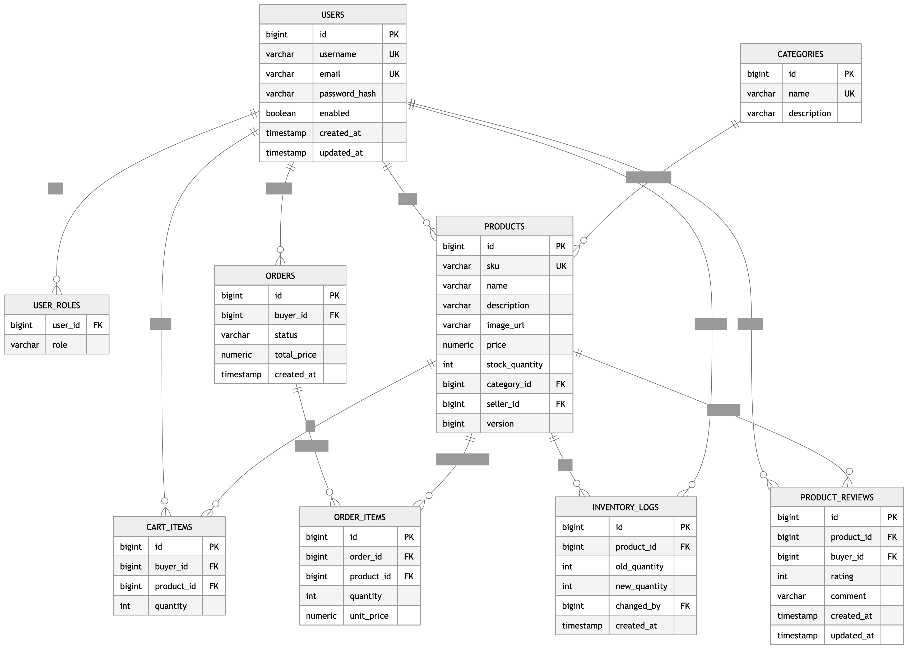
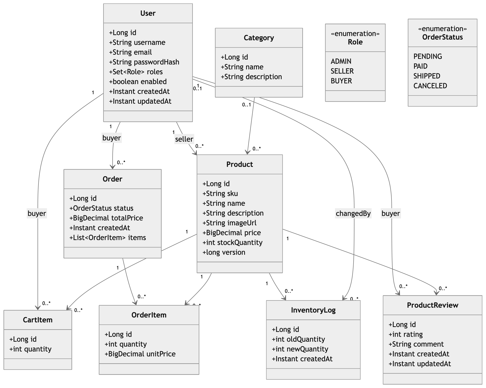
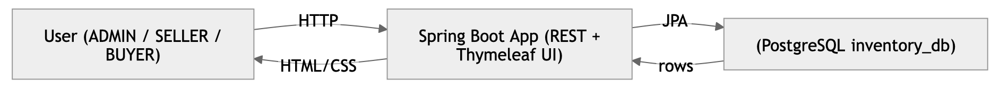
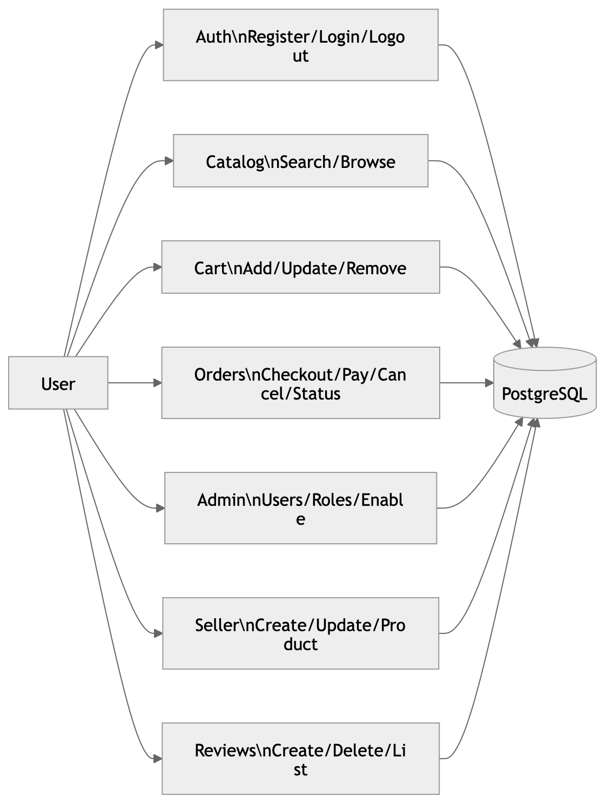
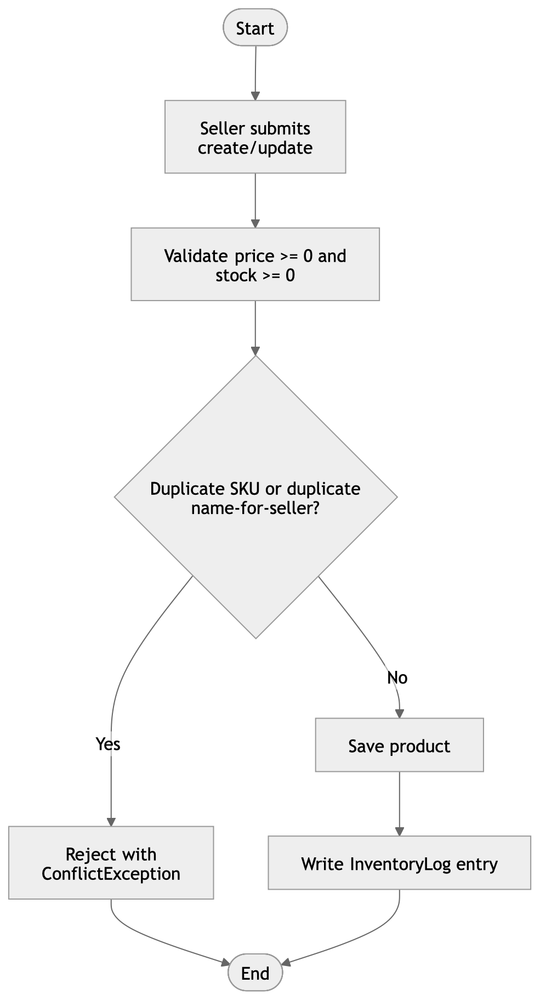
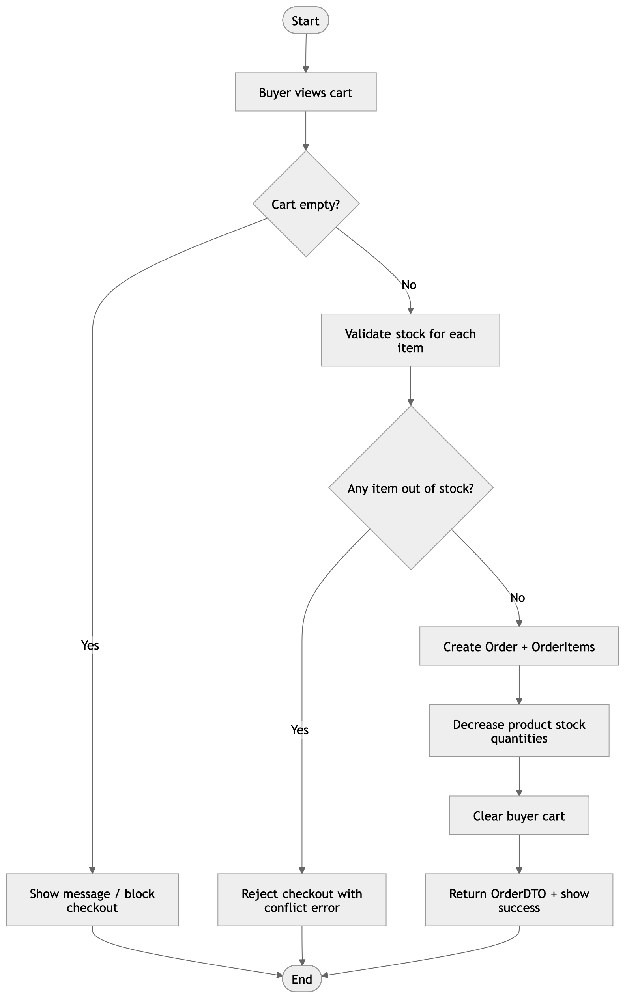
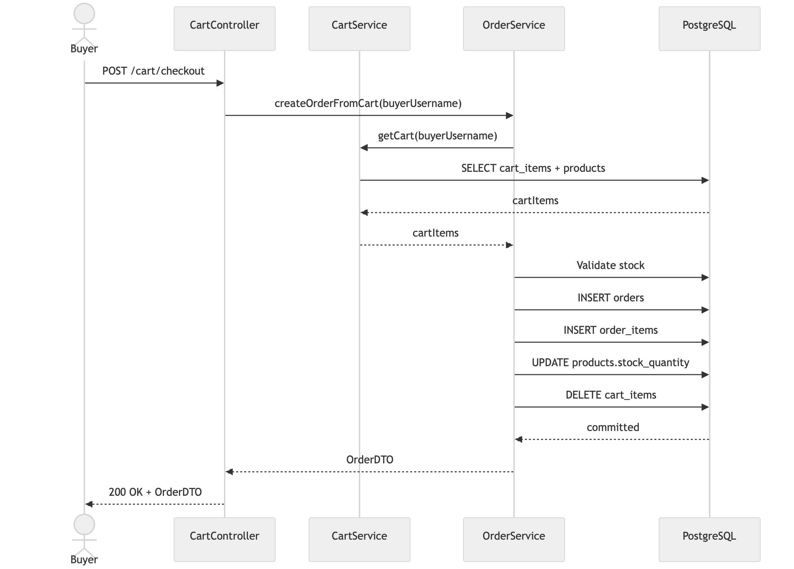
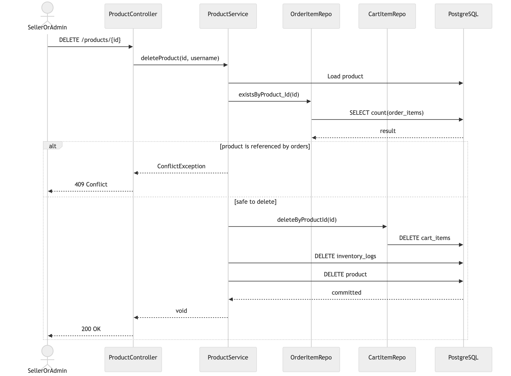

# Inventory Management (Spring Boot)

This project implements a simple inventory management system with:
- Users + roles (ADMIN/SELLER/BUYER)
- Products (owned by a SELLER)
- Cart and Orders (BUYER)
- Product reviews (BUYER + ADMIN moderation)
- REST endpoints + Thymeleaf UI pages (dashboard, products, cart, orders, admin)

## Default seeded users
On startup, the app seeds 3 users:
- admin / admin123 (ROLE_ADMIN)
- seller / seller123 (ROLE_SELLER)
- buyer / buyer123 (ROLE_BUYER)

## Run locally
- Configure Postgres in `src/main/resources/application.yml` (defaults provided)
- Start the app from IDE or Maven.

## Run with Docker
Use `docker compose up --build` to start Postgres + app.

## UI pages
- `/` dashboard
- `/login` login
- `/register` register (buyer)
- `/ui/products` product catalog + management section (seller/admin)
- `/ui/cart` cart + checkout (buyer)
- `/ui/orders` buyer **Orders** page — your orders, line items, total cost, status (`/my-orders` redirects here)
- `/ui/admin/orders` all orders (admin UI)
- `/ui/admin` user management (admin)
- `/ui/admin/products` inventory management (admin)
- `/ui/reports` reports (admin)

## REST endpoints
AuthController
- POST `/auth/register`
- POST `/auth/login` (handled by Spring Security)
- POST `/auth/logout`

ProductController
- GET `/products`
- GET `/products/{id}`
- POST `/products`
- PUT `/products/{id}`
- DELETE `/products/{id}`

ProductReviewController
- GET `/products/{productId}/reviews`
- POST `/products/{productId}/reviews`
- DELETE `/products/{productId}/reviews/{reviewId}`

OrderController
- POST `/orders`
- GET `/orders`
- GET `/orders/{id}`
- PUT `/orders/{id}/status` (ADMIN)
- PUT `/orders/{id}/status/seller` (SELLER)
- POST `/orders/{id}/cancel`
- POST `/orders/{id}/pay/demo` (demo payment)

CartController
- POST `/cart/add`
- DELETE `/cart/remove`
- GET `/cart`
- POST `/cart/checkout` (creates an order from cart)

AdminController
- GET `/admin/users`
- POST `/admin/users`
- PUT `/admin/users/{id}`
- PUT `/admin/users/{id}/role`
- PUT `/admin/users/{id}/roles`
- PATCH `/admin/users/{id}/enabled`
- DELETE `/admin/users/{id}`

### ER diagram (tables + relationships)

### Class diagram (domain model)

### DFD Level 0 (context diagram)

### DFD Level 1 (major processes)

### Activity: Seller product management flow (create/update/delete)

### Activity: Buyer checkout flow (cart → order)

### Sequence: Checkout (REST) `/cart/checkout`

### Sequence: Product delete (REST) `/products/{id}`

## Notes
- Security rules are configured in `SecurityConfig`.
- Edge cases like negative price/stock, duplicate SKU, stock checks, and seller ownership checks are enforced in services.
